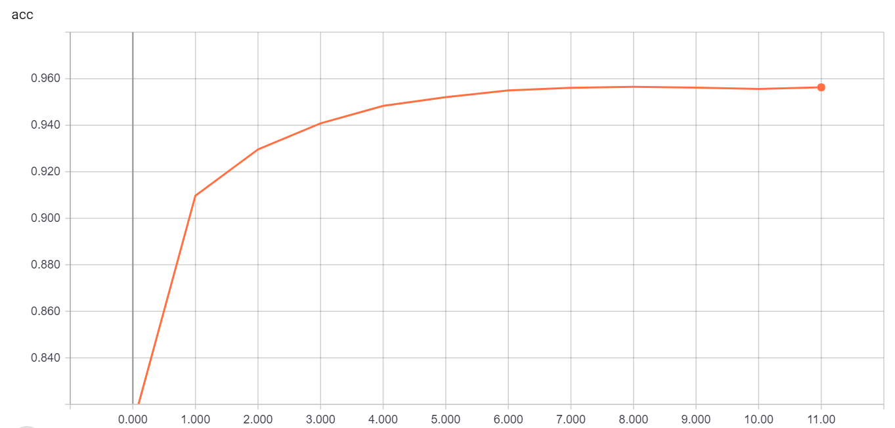
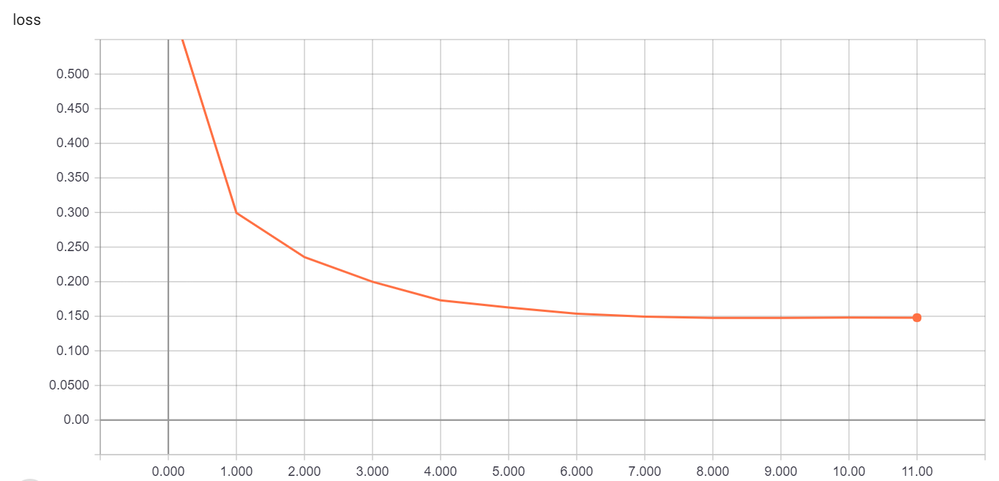
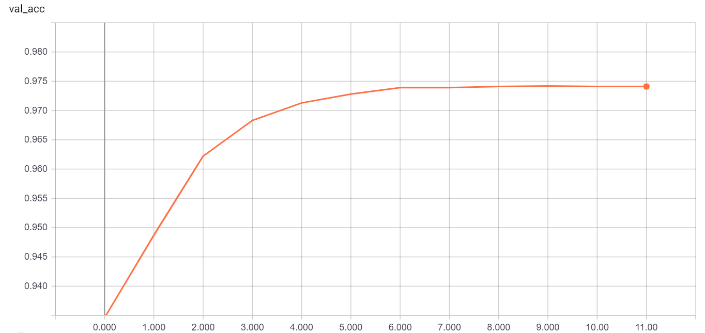
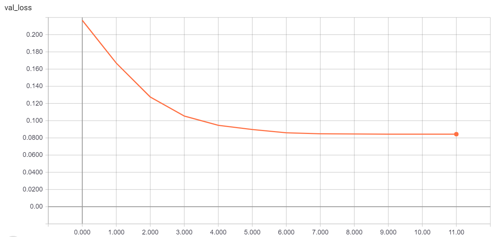
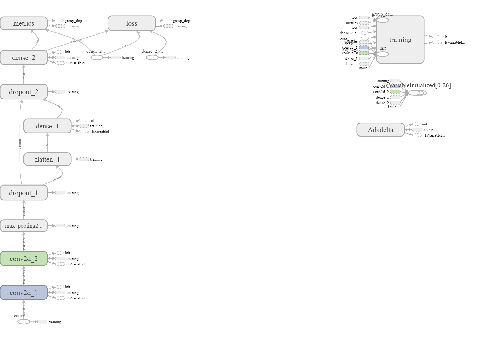

# MnistOnKeras
Implemention of lightweight CNN Model on Mnist Dataset,try to include as more as possible features that I learn from keras, by the way,compare to tensorflow.hope to give a good learning example.

# Keras_workflow

&emsp;&emsp;I used to using tensorflow, recently, decide to pay more attention to keras.so it's a guide example which shows how to train a model by keras.I found training a model by keras can be done in six steps:

1.  prepare a Dataset
2. build a model
3. compile the model(`compile()`)
4. train the model(`fit()`)
5. validate the model(`valuate()`)
6. optionly, predict on new data(`predict()`)

# Train_my_model

- train

&emsp;

- validation

&emsp;

&emsp;

- net-structure

# Contact

&emsp;&emsp;Live and Learn, happy to exchange study, so any question, you can contact me: jeffery_cpu@163.com